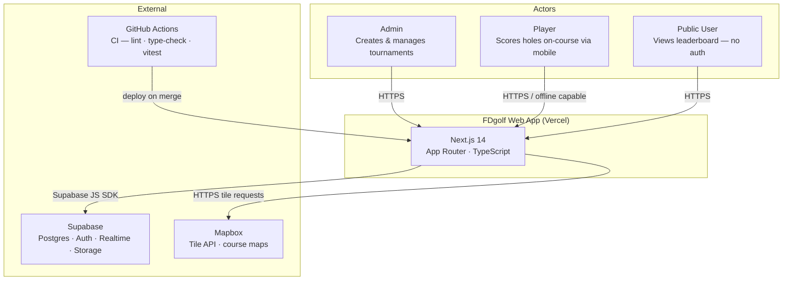
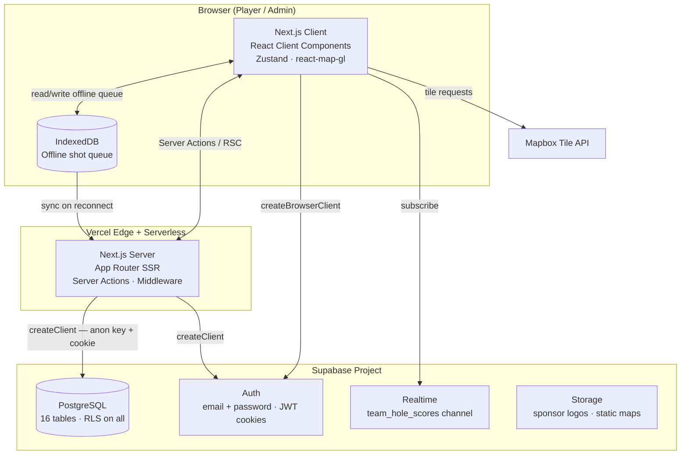
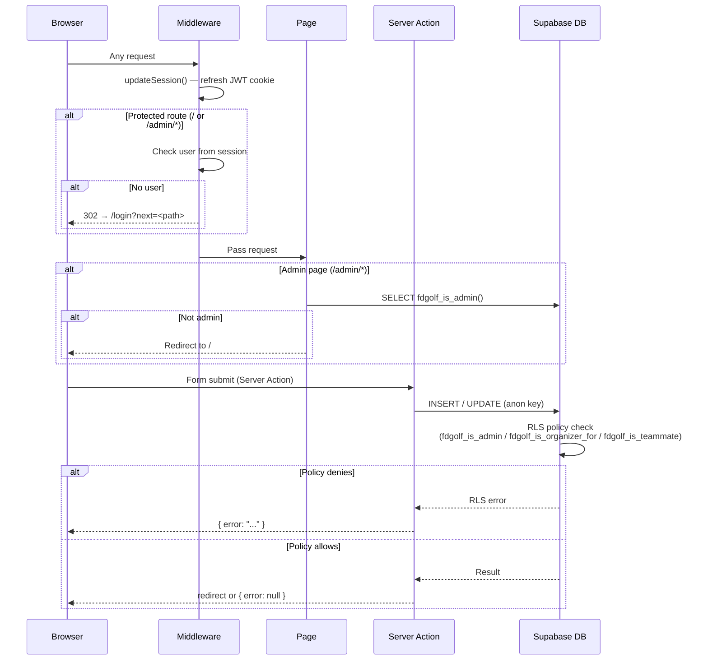
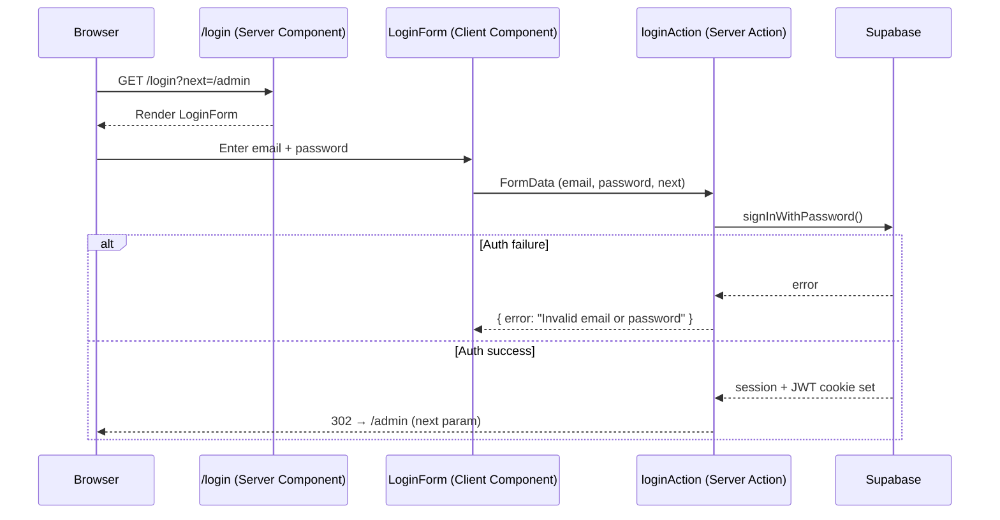
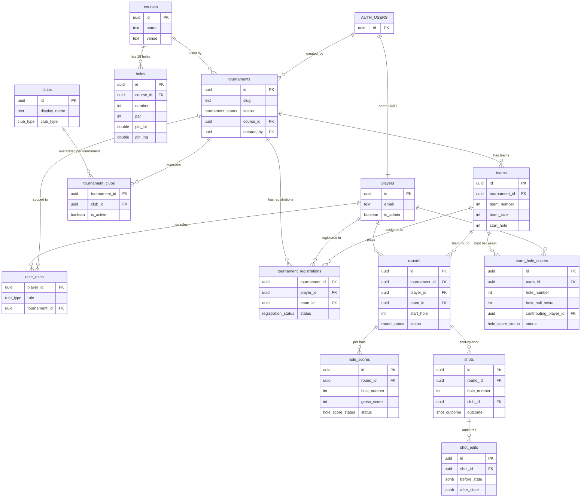
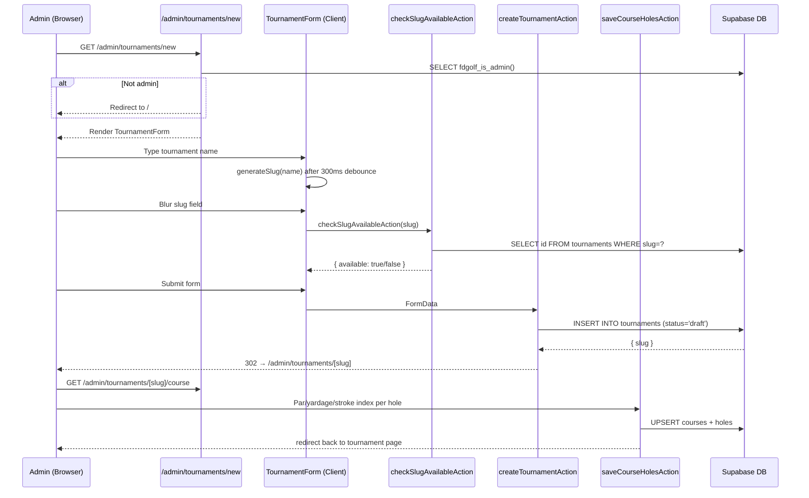
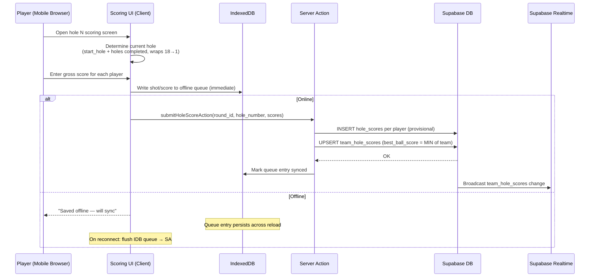
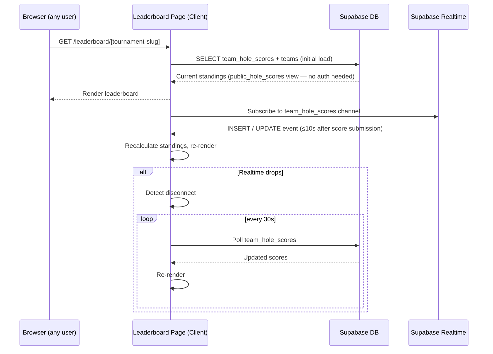

# FDgolf — Architecture

> Living reference. Update diagrams when component boundaries, data flows, or key journeys change.
> Source of truth for design decisions: `docs/superpowers/specs/2026-06-08-fdgolf-poc-design.md`

---

## 1. System Context

Actors and external dependencies at the highest level.



---

## 2. Container Architecture

The deployable units and how they communicate.



---

## 3. Component Architecture

Inside the Next.js app — layer boundaries that matter when writing new features.

```mermaid
graph LR
    subgraph Middleware["middleware.ts (Edge)"]
        MW[updateSession<br/>refresh Supabase cookie]
        MW -->|unauthenticated → redirect| LOGIN[/login]
    end

    subgraph ServerLayer["Server Layer (no 'use client')"]
        PAGE[Page / Layout<br/>Server Components]
        SA[Server Actions<br/>lib/actions/*.ts]
        SC[lib/supabase/server.ts<br/>createClient — cookie-based]
        PAGE -->|call| SA
        SA -->|query/mutate| SC
    end

    subgraph ClientLayer["Client Layer ('use client')"]
        CC[Client Components<br/>components/*.tsx]
        BC[lib/supabase/client.ts<br/>createBrowserClient]
        ZU[Zustand store<br/>round state]
        MV[MapView<br/>react-map-gl + Mapbox GL]
        CC -->|reads| BC
        CC -->|read/write| ZU
        CC --> MV
    end

    subgraph DB["Supabase"]
        SB[(Postgres + RLS)]
        AUTHZ[fdgolf_is_admin<br/>fdgolf_is_organizer_for<br/>fdgolf_is_teammate]
    end

    SC -->|anon key + RLS| SB
    BC -->|anon key + RLS| SB
    SB --- AUTHZ
```

**Key rules:**
- Never import `lib/supabase/server` from a Client Component (it uses `next/headers`).
- Never import `lib/supabase/client` from a Server Component or Server Action.
- All DB writes go through Server Actions — never raw queries in components.
- Middleware checks **authentication only**; authorization (`fdgolf_is_admin()`, RLS) is enforced at the page or DB level.

---

## 4. Auth & Authorisation Flow



**Login flow specifically:**



---

## 5. Database Schema Groups

Simplified clusters — key foreign keys only. All 16 tables have RLS enabled.



**RLS helper functions** (SECURITY DEFINER, evaluated per query):

| Function | Returns true when… |
|---|---|
| `fdgolf_is_admin()` | caller has `role='admin'` in `user_roles` (global) |
| `fdgolf_is_organizer_for(tournament_id)` | caller has `role='tournament_organizer'` for that tournament |
| `fdgolf_is_teammate(team_id)` | caller has a registration row for the same team |

---

## 6. User Journeys

### 6.1 Login / Auth

Covered in §4 above.

---

### 6.2 Tournament Creation (Admin)



---

### 6.3 Scoring a Hole *(EPIC-0005 — planned, not yet built)*

Designed flow based on schema. Offline-first is a non-negotiable constraint.



**Conflict resolution on sync:** `updated_at` newer-wins; admin edits always win (tracked via `shot_edits` audit table).

---

### 6.4 Live Leaderboard *(EPIC-0007 — planned, not yet built)*



**Public access:** The `public_hole_scores` view has a permissive RLS SELECT policy so the leaderboard URL is shareable without authentication.
